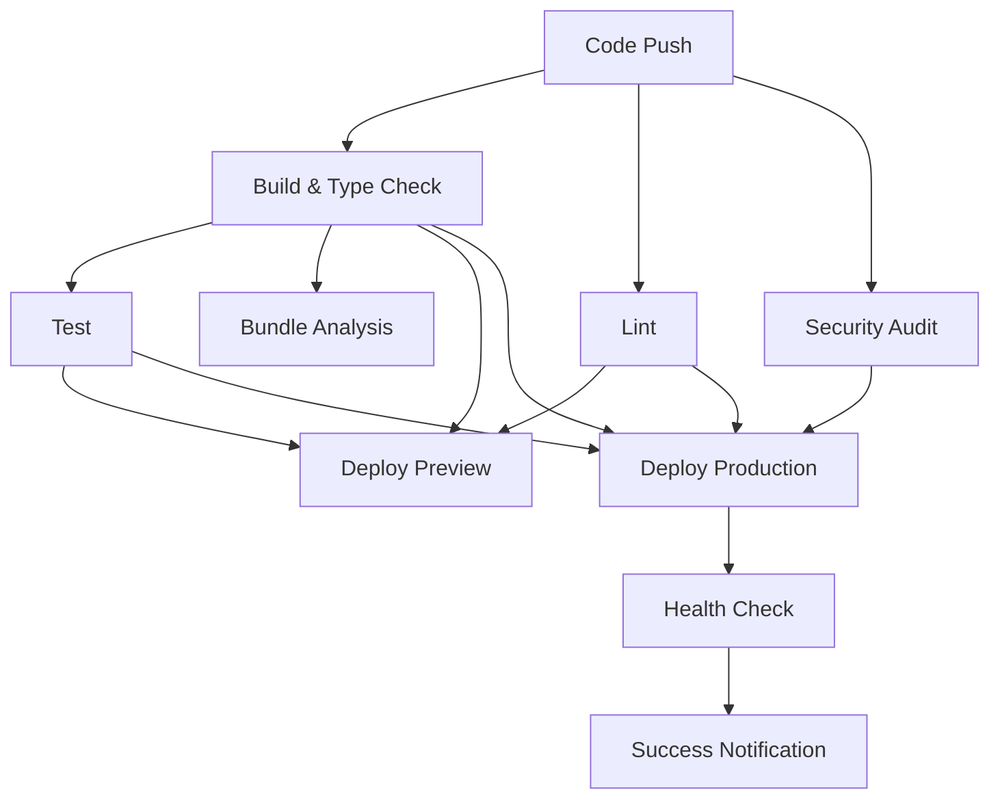

# ⚡ CI/CD Quick Reference

## 🚀 Workflow Triggers

| Action | Trigger | Result |
|--------|---------|--------|
| Push to `main-for-vercel` | Full CI + Production deploy | 🏭 Production site updated |
| Push to `develop` | Full CI + Preview deploy | 🔍 Preview deployment |
| Create/update PR | Full CI + Preview deploy | 💬 PR comment with preview URL |
| Modify config files | Configuration validation | ✅ Config checks only |

## 🗂️ Workflow Files

```
.github/workflows/
├── ci-cd.yml              # Main CI/CD pipeline
├── validate-config.yml    # Configuration validation
├── chromatic.yml          # Visual testing (existing)
├── pr-security-check.yml  # Security checks (existing)
└── security-audit.yml     # Security audit (existing)
```

## 🛠️ Local Development Commands

```bash
# Run all CI checks locally
npm run build              # Build the application
npm run lint               # ESLint code checking
npm run type-check         # TypeScript validation
npm run test               # Run Jest tests
npm run test:coverage      # Run tests with coverage

# Development
npm run dev                # Start development server
npm run storybook          # Start Storybook

# Production testing
npm run start              # Start production server (after build)
```

## 📊 Workflow Status Monitoring

### GitHub CLI Commands

```bash
# Install GitHub CLI
gh auth login

# View recent workflow runs
gh run list

# View specific run details
gh run view <run-id>

# Watch live workflow
gh run watch

# View logs for failed run
gh run view <run-id> --log-failed
```

### Web Interface

- **All workflows**: `https://github.com/YOUR_REPO/actions`
- **Specific workflow**: `https://github.com/YOUR_REPO/actions/workflows/ci-cd.yml`
- **Branch status**: Visible on PR and branch pages

## 🔐 Required GitHub Secrets

| Secret | Purpose | How to Get |
|--------|---------|------------|
| `VERCEL_TOKEN` | Vercel API authentication | [Vercel Tokens](https://vercel.com/account/tokens) |
| `VERCEL_ORG_ID` | Organization identifier | `vercel whoami` |
| `VERCEL_PROJECT_ID` | Project identifier | `vercel project ls` |

### Quick Setup Commands

```bash
# Install Vercel CLI
npm i -g vercel

# Get required information
vercel login
vercel whoami                    # Get ORG_ID
vercel project ls                # Get PROJECT_ID
```

## 🎯 Common Tasks

### Force Redeploy

```bash
# Trigger redeploy without changes
git commit --allow-empty -m "trigger: redeploy"
git push origin main-for-vercel
```

### Skip CI for Documentation

```bash
# Skip CI for docs-only changes
git commit -m "docs: update README [skip ci]"
```

### Debug Build Issues

```bash
# Run exact build command that CI uses
SKIP_ENV_VALIDATION=true npm run build

# Check bundle size
npm run build && du -sh .next/

# Analyze large files
find .next/static -type f -size +500k -exec ls -lh {} \;
```

### Test PR Preview

1. Create feature branch
2. Push changes
3. Create PR
4. Check PR comments for preview URL
5. Verify preview deployment

## 🚨 Troubleshooting Quick Fixes

| Issue | Quick Fix |
|-------|-----------|
| **Build fails with env errors** | Check `SKIP_ENV_VALIDATION=true` is set |
| **Vercel deployment fails** | Verify secrets are correct and not expired |
| **Type check fails** | Run `npm run type-check` locally |
| **Tests fail in CI only** | Check for async/timing issues |
| **Bundle size warnings** | Check for accidentally committed large files |
| **Health check fails** | Verify production URL is accessible |

## 📈 Performance Targets

| Metric | Target | Current Status |
|--------|--------|----------------|
| Build time | < 5 minutes | ✅ ~3 minutes |
| Bundle size | < 2MB total | ✅ Check artifacts |
| Test coverage | > 60% | 📊 See reports |
| Security audit | 0 high/critical | 🔒 Monitored |

## 🔗 Useful Links

### Documentation
- [Setup Instructions](./.github/SETUP_INSTRUCTIONS.md)
- [GitHub Actions Docs](https://docs.github.com/en/actions)
- [Vercel Deployment Docs](https://vercel.com/docs/deployments/overview)

### Dashboards
- [GitHub Actions](https://github.com/YOUR_REPO/actions)
- [Vercel Dashboard](https://vercel.com/dashboard)
- [Production Site](https://lovas-political-site-fixed-80xah7hpe.vercel.app)

### Support
- [GitHub Issues](https://github.com/YOUR_REPO/issues)
- [Vercel Support](https://vercel.com/help)

## 🔄 Workflow Dependencies



## 💡 Pro Tips

### Development Workflow
1. **Feature branches**: Always create from `develop`
2. **PR first**: Create draft PR early for preview deployments
3. **Local testing**: Run `npm run type-check && npm run lint` before push
4. **Clean commits**: Use conventional commit messages

### CI Optimization
1. **Cache hits**: Don't delete `node_modules` unnecessarily
2. **Parallel jobs**: Lint and security run parallel to build
3. **Artifact reuse**: Build artifacts are shared between jobs
4. **Concurrency**: Old runs auto-cancel when new ones start

### Deployment Strategy
1. **Preview first**: Always test in preview before merging
2. **Health checks**: Monitor post-deployment health checks
3. **Rollback ready**: Keep previous deployment ready for rollback
4. **Monitor logs**: Check Vercel function logs for issues

---

*Quick Reference v1.0*
*For detailed setup: see [SETUP_INSTRUCTIONS.md](./.github/SETUP_INSTRUCTIONS.md)*