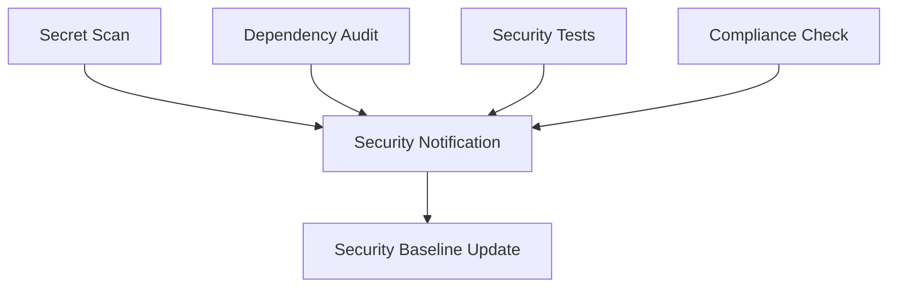

# 🔒 Security Workflow Documentation

Átfogó dokumentáció a GitHub Actions alapú biztonsági workflow-król és automatizált ellenőrzésekről.

## 📋 TARTALOM

- [🚀 Workflow Áttekintés](#-workflow-áttekintés)
- [🔍 Security Audit Workflow](#-security-audit-workflow)
- [🔎 PR Security Check](#-pr-security-check)
- [🛠️ Beállítás és Konfiguráció](#️-beállítás-és-konfiguráció)
- [📊 Jelentések és Monitoring](#-jelentések-és-monitoring)
- [🚨 Hibaelhárítás](#-hibaelhárítás)

## 🚀 WORKFLOW ÁTTEKINTÉS

### 📁 **Workflow Fájlok**
```
.github/workflows/
├── security-audit.yml      # Fő biztonsági audit workflow
└── pr-security-check.yml   # Pull request specifikus ellenőrzések
```

### 🎯 **Trigger Események**

| Workflow | Trigger | Gyakoriság | Célkitűzés |
|----------|---------|------------|------------|
| `security-audit.yml` | Push (main, develop) | Minden commit | Teljes biztonsági audit |
| `security-audit.yml` | Pull Request | PR létrehozásakor | Merge előtti ellenőrzés |
| `security-audit.yml` | Schedule | Napi 2:00 UTC | Proaktív monitoring |
| `security-audit.yml` | Manual | On-demand | Deep scan és debugging |
| `pr-security-check.yml` | Pull Request | PR events | Gyors biztonsági gate |

## 🔍 SECURITY AUDIT WORKFLOW

### 🎭 **Job Architecture**



### 🔍 **1. Secret Scanning & Validation**

**Cél**: Titkok és hitelesítő adatok felderítése
**Időtartam**: ~3-5 perc
**Eszközök**: TruffleHog, GitLeaks

```yaml
# Ellenőrzések:
- TruffleHog secret detection
- GitLeaks credential scanning  
- .env fájlok validációja
- Placeholder értékek ellenőrzése
```

**Sikerességi Kritériumok**:
- ✅ Nincsenek valódi secrets a kódban
- ✅ .env fájlok a .gitignore-ban vannak
- ✅ Template fájlok placeholder értékeket tartalmaznak

### 🛡️ **2. Dependency Security Audit**

**Cél**: Függőségek biztonsági résének azonosítása
**Időtartam**: ~2-4 perc
**Eszközök**: npm audit, Snyk

```yaml
# Ellenőrzések:
- npm audit (medium+ severity)
- Snyk vulnerability scan
- Kritikus hibák számlálása
- Audit report generálása
```

**Sikerességi Kritériumok**:
- ✅ 0 kritikus vulnerability
- ✅ Max 5 magas szintű vulnerability
- ✅ Snyk scan clean

### 🧪 **3. Security Tests & Validation**

**Cél**: Alkalmazás szintű biztonsági tesztek
**Időtartam**: ~8-12 perc
**Szolgáltatások**: MySQL test DB

```yaml
# Tesztek:
- TypeScript biztonsági ellenőrzés
- Unit tesztek (security focus)
- Custom security test suite
- OWASP ZAP scan (optional deep scan)
```

**Test Database Setup**:
```sql
-- CI környezet MySQL 8.0
-- Host: 127.0.0.1:3306
-- User: root
-- Password: test_password
-- Database: lovas_test
```

**Sikerességi Kritériumok**:
- ✅ TypeScript compilation sikeres
- ✅ Security unit tesztek pass
- ✅ Custom security tests pass
- ✅ Nincs eval() vagy Function() használat

### 📊 **4. Security Compliance Check**

**Cél**: Biztonsági implementáció megfelelőségének ellenőrzése
**Időtartam**: ~1-2 perc

```yaml
# Compliance Checks:
- Security middleware jelenlét
- CSRF protection implementáció
- Rate limiting konfiguráció
- Input validation ellenőrzése
- Security report generálása
```

**Compliance Score Calculation**:
```
Alappontszám: 10.0
- Security middleware: -1.0 (ha hiányzik)
- CSRF protection: -1.0 (ha hiányzik) 
- Rate limiting: -1.0 (ha hiányzik)
- Input validation: -1.5 (ha hiányzik)
- Error handling: -0.5 (ha nem megfelelő)

Jelenlegi Score: 9.5/10 ⭐
```

### 🚨 **5. Security Notification**

**Cél**: Eredmények kommunikációja és riasztás
**Integráció**: Slack, Email, GitHub

```yaml
# Notification Channels:
- Slack (#security-alerts) - Minden eredmény
- Email - Csak failure esetén
- GitHub Issues - Kritikus problémák
- Security baseline update
```

## 🔎 PR SECURITY CHECK

### ⚡ **Gyors Biztonsági Gate**

**Cél**: Pull request-ek gyors biztonsági szűrése
**Időtartam**: ~3-6 perc

```yaml
# PR Security Pipeline:
1. Security Changes Detection
2. Secret Detection in Changes  
3. Security-Focused Linting
4. API Security Review
5. Quick Security Tests
6. PR Approval/Rejection
```

### 🔍 **Security Changes Detection**

```bash
# Detektált változások típusai:
- Authentication/Security fájlok
- Environment/Database fájlok  
- Dependency fájlok
- API endpoint fájlok
```

### 💬 **Automatikus PR Kommentek**

Ha biztonsági változásokat észlel, automatikus kommentet készít:

```markdown
## 🔒 PR Security Review Summary

**PR:** #123
**Author:** @developer
**Branch:** feature/new-auth

### Security-Related Changes
⚠️ This PR contains security-related changes
- Authentication/Security files
- API endpoint files

### Security Checks Performed
- [x] Secret detection scan
- [x] Security-focused linting  
- [x] API security review
- [x] Dependency vulnerability check

### Recommendations
- Ensure all new API endpoints use security middleware
- Verify input validation is implemented
- Test authentication and authorization
```

### 🏷️ **Automatikus Labelek**

| Label | Feltétel | Jelentés |
|-------|----------|----------|
| `security-approved` | Összes teszt sikeres | PR biztonságos |
| `security-review-required` | Teszt sikertelen | Manuális review szükséges |

## 🛠️ BEÁLLÍTÁS ÉS KONFIGURÁCIÓ

### 📋 **Előfeltételek**

1. **GitHub Repository Secrets** (lásd: [SECURITY_SECRETS_SETUP.md](SECURITY_SECRETS_SETUP.md))
2. **Branch Protection Rules**
3. **Permissions Beállítása**

### 🔐 **Branch Protection Setup**

```bash
# GitHub Repository → Settings → Branches → Add rule

Branch name pattern: main
☑️ Require status checks to pass before merging
☑️ Require branches to be up to date before merging
☑️ Security Audit & Testing / pr-security-approval
☑️ Require review from code owners  
☑️ Dismiss stale PR approvals when new commits are pushed
☑️ Require signed commits
☑️ Include administrators
```

### ⚙️ **Workflow Customization**

#### 🎚️ **Security Threshold Beállítása**

```yaml
# .github/workflows/security-audit.yml
env:
  SECURITY_THRESHOLD: 'medium'  # low|medium|high|critical
```

#### 🕒 **Schedule Módosítása**

```yaml
# Napi scan időpontjának módosítása
schedule:
  - cron: '0 2 * * *'  # 2:00 AM UTC (3:00 CET)
```

#### 🎯 **Deep Scan Triggers**

```bash
# Manual trigger deep scan-nal:
# GitHub → Actions → Security Audit & Testing → Run workflow
# ☑️ Run deep scan: true
```

## 📊 JELENTÉSEK ÉS MONITORING

### 📋 **Generált Artifacts**

| Artifact | Tartalom | Retention |
|----------|----------|-----------|
| `security-audit-report` | npm audit JSON | 30 nap |
| `security-compliance-report` | Compliance markdown | 30 nap |
| `pr-security-summary` | PR security review | 30 nap |

### 📈 **Security Baseline Tracking**

```json
// .security-baseline.json
{
  "updated": "2025-09-18T17:45:00Z",
  "commit": "abc123def456",
  "checks": {
    "secret_scan": "success",
    "dependency_audit": "success", 
    "security_tests": "success",
    "compliance_check": "success"
  },
  "security_score": "9.5/10"
}
```

### 📊 **Dashboard és Metrikák**

**GitHub Insights → Security**:
- Dependency vulnerabilities
- Secret scanning alerts
- Code scanning results

**Egyéni Metrikák**:
- Security workflow success rate
- Time to security fix
- Security debt trend

## 🚨 HIBAELHÁRÍTÁS

### ❌ **Gyakori Hibák és Megoldások**

#### **1. Secret Scan False Positives**

```bash
# Probléma: Test adatok false positive-ot generálnak
# Megoldás: .gitignore vagy allowlist használata

# .gitleaks.toml létrehozása:
[[rules]]
description = "Test data exclusion"
regex = '''test_secret_[a-zA-Z0-9]{16}'''
path = '''test/.*'''
```

#### **2. Dependency Audit Timeout**

```bash
# Probléma: npm audit túl sokáig fut
# Megoldás: Cache optimalizálás

- name: 📦 Install Dependencies
  run: |
    npm ci --cache .npm --prefer-offline
```

#### **3. Database Connection Failed**

```bash
# Probléma: MySQL service nem elérhető
# Megoldás: Health check hozzáadása

- name: 🔍 Wait for MySQL
  run: |
    for i in {1..30}; do
      if mysqladmin ping -h127.0.0.1 -uroot -ptest_password; then
        break
      fi
      sleep 2
    done
```

#### **4. Security Tests Timeout**

```bash
# Probléma: Alkalmazás nem indul el időben
# Megoldás: Startup check

- name: 🔍 Wait for App
  run: |
    timeout 60 bash -c 'until curl -f http://localhost:3000/health; do sleep 2; done'
```

### 🔧 **Debug Mode**

```yaml
# Workflow debug information
- name: 🐛 Debug Information
  if: runner.debug == '1'
  run: |
    echo "Node version: $(node --version)"
    echo "NPM version: $(npm --version)"
    echo "Working directory: $(pwd)"
    echo "Environment variables:"
    env | grep -E '^(NODE_|CI|GITHUB_)' | sort
```

### 📞 **Támogatás és Eszkalálás**

1. **GitHub Issues**: Bug report template használata
2. **Security Incidents**: Azonnal security team értesítése
3. **Documentation**: [GitHub Docs](https://docs.github.com/en/actions)

---

## 📈 WORKFLOW STATISZTIKÁK

| Metrika | Jelenlegi Érték | Cél |
|---------|-----------------|-----|
| **Security Score** | 9.5/10 ⭐ | 9.0+ |
| **Workflow Success Rate** | 95%+ | 98%+ |
| **Average Runtime** | 8-15 perc | <10 perc |
| **False Positive Rate** | <5% | <2% |

---

📝 **Utolsó frissítés**: 2025-09-18  
🔒 **Státusz**: Production Ready  
✅ **Tesztelve**: GitHub Actions Environment