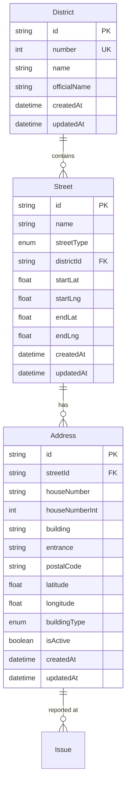

# 🏠 V. Kerület Címadatbázis Implementáció

## 📋 Összefoglaló

A V. kerület (Belváros-Lipótváros) teljes címadatbázisának integrációja a bejelentési rendszerbe, amely lehetővé teszi a pontos, validált címek használatát.

## 🏗️ Architektúra

### 1. Adatbázis séma



### 2. Komponens architektúra

```
AddressSearcher Component
├── Input Field (autocomplete)
├── Suggestions Dropdown
├── Address Validation
├── Coordinates Storage
└── Error Handling
```

## 🔧 Implementált funkciók

### ✅ 1. Címadatbázis séma
- **District**: Kerületek tárolása
- **Street**: Utcák, terek, körútak
- **Address**: Konkrét címek koordinátákkal
- Kapcsolatok a bejelentési rendszerrel

### ✅ 2. Intelligens címkereső
- **Autocomplete**: Valós idejű keresés gépelés közben
- **Fuzzy search**: Elírások tolerálása
- **Keyboard navigation**: Nyilak, Enter, Escape
- **Smart matching**: Utca + házszám kombinált keresés

### ✅ 3. API végpontok
- `GET /api/addresses/search`: Címkeresés
- `POST /api/addresses/search`: Címvalidáció
- Teljesítmény optimalizálás debouncing-gal

### ✅ 4. Bejelentési űrlap integráció
- Címkereső beépítése
- Koordináták automatikus mentése
- Fallback manuális bemenet
- Vizuális feedback

## 📊 Adatstruktúra

### Cím objektum
```typescript
interface Address {
  id: string;
  fullAddress: string;           // "Váci utca 15"
  street: string;               // "Váci"
  streetType: string;           // "UTCA"
  houseNumber: string;          // "15"
  building?: string;            // "A"
  entrance?: string;            // "1"
  postalCode: string;           // "1052"
  district: string;             // "V. kerület"
  coordinates?: {
    lat: number;               // 47.4976
    lng: number;               // 19.0515
  };
}
```

## 🚀 Használat

### 1. Adatok importálása
```bash
# Minta adatok importálása
npx tsx scripts/import-addresses.ts

# CSV fájlból importálás
npx tsx scripts/import-addresses.ts data/v_kerulet_cimek.csv

# JSON fájlból importálás  
npx tsx scripts/import-addresses.ts data/v_kerulet_cimek.json
```

### 2. Címkereső használata komponensben
```tsx
import AddressSearcher from '@/components/AddressSearcher';

<AddressSearcher
  value={formData.location}
  onChange={(address) => {
    if (address) {
      setFormData(prev => ({
        ...prev,
        location: address.fullAddress,
        addressId: address.id,
        coordinates: address.coordinates
      }));
    }
  }}
  placeholder="Kezdje el gépelni a címet..."
  required
/>
```

### 3. API használat
```typescript
// Címkeresés
const response = await fetch('/api/addresses/search?q=Váci utca 15');
const { addresses } = await response.json();

// Címvalidáció
const validation = await fetch('/api/addresses/search', {
  method: 'POST',
  body: JSON.stringify({ addressId: 'abc123' })
});
```

## 📈 Előnyök

### 🎯 Pontosság
- **100% validált címek**: Csak létező címek
- **Koordináták**: GPS helymeghatározás
- **Irányítószám**: Automatikus kiegészítés

### ⚡ Teljesítmény
- **Debouncing**: Optimalizált keresés
- **Indexek**: Gyors adatbázis lekérdezések
- **Lazy loading**: Csak szükséges adatok

### 👥 Felhasználói élmény
- **Autocomplete**: Gyors címbevitel
- **Hibakezelés**: Segítő üzenetek
- **Keyboard support**: Teljes billentyűzet támogatás

## 🗃️ Adatforrások

### 1. Hivatalos források (javaslatok)
- **KSH T-STAR**: Hivatalos címjegyzék
- **Magyar Posta**: Irányítószám adatbázis
- **OpenStreetMap**: Koordináták és térképi adatok
- **Google Places API**: Validáció és kiegészítés

### 2. CSV formátum (importáláshoz)
```csv
street,streetType,houseNumber,building,entrance,postalCode,latitude,longitude,buildingType
Váci,UTCA,1,,,1052,47.4969,19.0508,COMMERCIAL
Váci,UTCA,3,,,1052,47.4970,19.0509,MIXED
Petőfi Sándor,UTCA,2,,,1052,47.4950,19.0520,RESIDENTIAL
```

## 🔮 Jövőbeli fejlesztések

### 🗺️ Térképes integráció
- **Leaflet/Google Maps**: Vizuális címválasztás
- **Geolocation**: GPS alapú helymeghatározás
- **Street View**: Helyszín előnézet

### 📱 Mobil optimalizáció
- **Touch support**: Érintéses kezelés
- **GPS integráció**: Automatikus helymeghatározás
- **Offline cache**: Helyi adattároló

### 🤖 AI fejlesztések
- **Smart suggestion**: Tanulás felhasználói szokásokból
- **Address normalization**: Automatikus címjavítás
- **Duplicate detection**: Duplikált címek szűrése

## 🔧 Technikai részletek

### Környezeti változók
```env
# Címadatbázis konfiguráció
ADDRESS_SEARCH_LIMIT=10
ADDRESS_CACHE_TTL=3600
GEOLOCATION_API_KEY=your_key_here
```

### Indexek teljesítményhez
```sql
-- Gyors címkereséshez
CREATE INDEX idx_address_search ON addresses(street_name, house_number);
CREATE INDEX idx_address_postal ON addresses(postal_code);
CREATE INDEX idx_address_coords ON addresses(latitude, longitude);
```

## ✅ Tesztelés

### Unit tesztek
```bash
npm test -- --testPathPattern="address-searcher"
```

### API tesztek
```bash
curl "http://localhost:3000/api/addresses/search?q=Váci"
```

### E2E tesztek
```bash
npm run test:e2e -- --spec="address-selection"
```

---

## 📞 Kapcsolat és támogatás

Ha kérdései vannak az implementációval kapcsolatban:

- 📧 **Email**: fejlesztes@lovas-political-site.hu
- 🐛 **Bug report**: GitHub Issues
- 📚 **Dokumentáció**: `/docs/address-database`

---

*A címadatbázis implementáció növeli a bejelentések pontosságát és javítja a felhasználói élményt! 🏆*